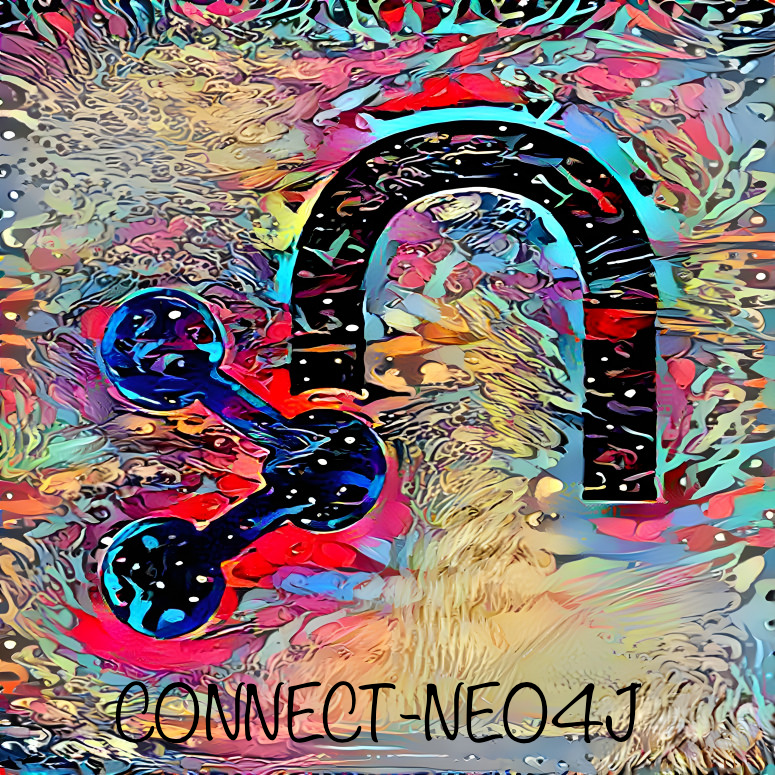

[](https://npmjs.com/package/connect-neo4j) [](https://gitter.im/jlongster/prettier) 



**connect-neo4j** provides Neo4j session storage for Express. Requires neo4j-driver >= `4.3.0`.

## Installation

npm:

```sh
npm install neo4j-driver connect-neo4j express-session
```

Yarn:

```sh
yarn add neo4j-driver connect-neo4j express-session
```

## API

```js
const session = require('express-session')
const neo4j = require('neo4j-driver')
const uri = process.env.NEO4J_URI || 'bolt://localhost:7687'
const user = process.env.NEO4J_USER || 'neo4j'
const password = process.env.NEO4J_PASSWORD || 'neo4j'
const driver = neo4j.driver(uri, neo4j.auth.basic(user, password))

let Neo4jStore = require('../lib/connect-neo4j')(session)

app.use(
  session({
    store: new Neo4jStore({ client: driver.session() }),
    saveUninitialized: false,
    secret: 'keyboard cat',
    resave: false,
  })
)
```

### Neo4jStore(options)

The `Neo4jStore` requires an existing Redis client. Any clients compatible with the [`redis`][1] API will work. See `client` option for more details.

#### Options

```js
let options = { // Defaults (excluding client)
        prefix: "sess:", //optional
        serializer: JSON, // optional, but must provide methods parse & stringify
        client: driver.session() // required
        nodeLabel: 'Session' //Optional, what to label you session nodes
        ttl: 86400 // Optional, set a default ttl (time to live).
        disableTTL: false //Optional, Disables TTL functionallity
        disableTouch: false // Optional, Disables Touch functionallty
}

let store = new Neo4jStore({ options ) })

```

#### Serializer

The encoder/decoder to use when storing and retrieving session data from Neo4j (default: `JSON`).

```ts
interface Serializer {
  parse(string): object
  stringify(object): string
}
```
